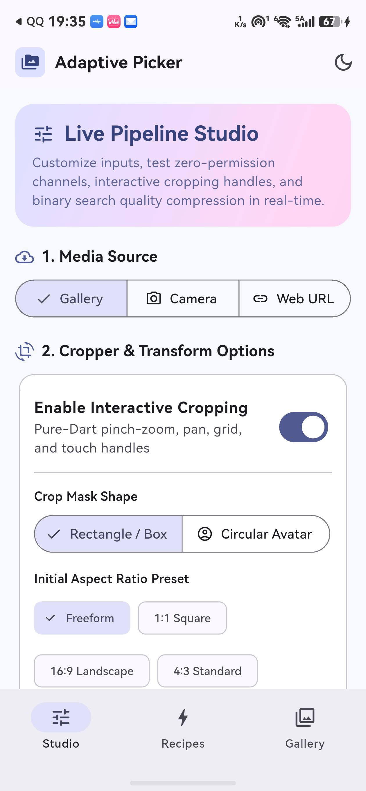

# Flutter 三方库 adaptive_image_picker 的 OpenHarmony 适配实战

> 本文记录了将开源 Flutter 三方库 `adaptive_image_picker` 适配到 OpenHarmony / HarmonyOS 平台的完整过程，包含适配思路、代码改动对照、关键决策和踩坑复盘。
>
> 适配过程中还顺带定位并修复了上游一个**会导致所有平台构建失败**的 `pubspec.yaml` 配置缺陷——这个 bug 与鸿蒙无关，但如果不修，鸿蒙适配根本无法验证。详见第 3.2 节与第八章。

---

## 一、背景

### 1.1 三方库简介

[adaptive_image_picker](https://github.com/Karan8686/adaptive_image_picker) 是一个 Flutter 社区广泛使用的自适应图片选择库，提供以下能力：

- **零权限图片选取** —— 通过系统 PhotoPicker 选取图片，应用无需申请媒体读写权限
- **相机拍照** —— 调用系统相机拍摄，支持指定前置/后置摄像头
- **纯 Dart 裁剪与压缩** —— 不依赖原生裁剪库，支持按目标体积二分压缩
- **多图批量选取** —— 一次选取多张图片并统一处理

该三方库最初支持 Android、iOS、Web、Windows、macOS、Linux 六个平台，本次任务将其适配到 **OpenHarmony / HarmonyOS** 平台。

> **原库地址**：[Karan8686/adaptive_image_picker](https://github.com/Karan8686/adaptive_image_picker)
> **适配仓库**：[jianguo888/adaptive_image_picker](https://github.com/jianguo888/adaptive_image_picker)

### 1.2 为什么选择这个库做适配

这个库有两点值得注意：

1. **它是"零权限"设计**。Android 侧在 API 33+ 用 `MediaStore.ACTION_PICK_IMAGES`（系统 Photo Picker），iOS 侧用 `PHPickerViewController`——都是系统托管的独立界面，应用只拿到用户明确选择的文件授权。OpenHarmony 的 `photoAccessHelper.PhotoViewPicker` 在设计理念上完全一致，**这是适配能成立的前提**。
2. **它的原生接口极简**。整个通道只有 3 个方法（`getPlatformVersion` / `pickImages` / `takePhoto`），其中 2 个是真正的业务方法。这意味着适配工作量可控，可以把精力放在"契约一致性"和"边界处理"上，而不是堆代码。

### 1.3 适配目标

| 维度 | 要求 |
|------|------|
| 功能一致性 | `pickImages` / `takePhoto` 行为与 Android 对齐，返回结构完全一致 |
| Dart 层零改动 | 不修改 `lib/` 下任何 Dart 代码，仅新增平台实现 |
| 权限 | 不申请任何权限（沿用原库零权限设计） |
| 工程规范 | 补全鸿蒙化 README、CHANGELOG，通过 `flutter analyze` |

---

## 二、适配路线图

整个适配分为 5 个阶段：

```
第 1 阶段：项目初始化   ── flutter create 生成 ohos/ 模板骨架
第 2 阶段：原生实现     ── Kotlin → ArkTS 翻译核心逻辑（工作量主体）
第 3 阶段：三方库注册   ── pubspec.yaml 注册 ohos 平台 + 修复上游配置缺陷
第 4 阶段：示例与构建   ── 生成 example/ohos 宿主工程，跑通 HAP 构建
第 5 阶段：真机验证     ── 集成测试上真机，确认 3 个方法全部到达原生层
```

---

## 三、逐步适配过程

### 第 1 阶段：项目初始化

使用 Flutter 命令行生成 OHOS 模板：

```bash
flutter create . --template=plugin --platforms=ohos
```

该命令自动生成 `ohos/` 目录的标准模板结构，包含必要的构建配置和入口文件。

**目录结构：**

```
ohos/
├── index.ets                              # 模块入口，导出插件类
├── oh-package.json5                       # 包配置
├── build-profile.json5                    # 构建配置
├── hvigorfile.ts                          # 构建脚本
└── src/main/
    ├── module.json5                       # HAR 模块配置
    └── ets/components/plugin/
        └── AdaptiveImagePickerPlugin.ets  # 原生实现（核心，本次 268 行）
```

**关键配置文件：**

`index.ets`（入口导出文件）

```typescript
import AdaptiveImagePickerPlugin from './src/main/ets/components/plugin/AdaptiveImagePickerPlugin';
export default AdaptiveImagePickerPlugin;
```

`oh-package.json5`（包配置）

```json5
{
  "name": "adaptive_image_picker",
  "version": "1.0.0",
  "main": "index.ets",
  "license": "Apache-2.0",
  "dependencies": {}
}
```

> **注**：`@ohos/flutter_ohos` 由 Flutter 引擎在构建时自动链接，无需在 `dependencies` 中显式声明。

`module.json5`（HAR 模块配置）

```json5
{
  "module": {
    "name": "adaptive_image_picker",
    "type": "har",
    "deviceTypes": ["default", "tablet"]
  }
}
```

注意这里**没有 `requestPermissions` 字段**——这是刻意的，后文 5.4 节会解释原因。

---

### 第 2 阶段：原生实现（核心）

#### 2.1 整体架构对比

`adaptive_image_picker` 属于**方法调用型**插件（`MethodChannel` + `MethodCallHandler`），由 Dart 主动发起调用，原生返回结果：

```
 Android (Kotlin)                          OHOS (ArkTS)
 ────────────────────                      ────────────────────
 class AdaptiveImagePickerPlugin           class AdaptiveImagePickerPlugin
   implements FlutterPlugin,                 implements FlutterPlugin,
              MethodCallHandler,                       MethodCallHandler,
              ActivityAware                            AbilityAware

   import io.flutter.embedding...            import { FlutterPlugin,
   import android.app.Activity                        FlutterPluginBinding,
   import android.content.Intent                      MethodCall,
                                                      MethodCallHandler,
                                                      MethodChannel,
                                                      MethodResult,
                                                      AbilityAware,
                                                      AbilityPluginBinding
                                                    } from '@ohos/flutter_ohos'

   Activity + onActivityResult 回调          UIAbility + Promise 回调
```

**最本质的差异**：Android 的媒体选取走 `startActivityForResult` + `onActivityResult` 的**两段式回调**，而 OpenHarmony 的 Picker 直接返回 `Promise`。这看起来是简化，但带来了一个必须自己处理的后果——**Android 用 `requestCode` 天然区分是选图还是拍照，而 Promise 模式下两种会话可能交错**，所以必须自己加并发守卫（见 2.4 节）。

#### 2.2 通道注册

| 平台 | 代码 |
|------|------|
| **Android** | `MethodChannel(flutterPluginBinding.binaryMessenger, "adaptive_image_picker")` |
| **OHOS** | `new MethodChannel(binding.getBinaryMessenger(), "adaptive_image_picker")` |

> **差异**：OHOS 用 `binding.getBinaryMessenger()` 获取消息通道，接口更简洁。**通道名必须完全一致**（`adaptive_image_picker`），这是 Dart 与原生之间的通信契约。

OHOS 侧还需要通过 `AbilityAware` 拿到 `UIAbilityContext`，因为 Picker 的调用需要一个 Context：

```typescript
onAttachedToAbility(binding: AbilityPluginBinding): void {
  this.context = binding.getAbility().context as common.UIAbilityContext
}

onDetachedFromAbility(): void {
  this.context = null
}
```

#### 2.3 原生方法实现对照

**方法一：`getPlatformVersion`**

| 平台 | 实现 | 返回值示例 |
|------|------|--------|
| Android | `result.success("Android ${Build.VERSION.RELEASE}")` | `Android 14` |
| OHOS | `result.success("OpenHarmony " + deviceInfo.osFullName)` | `OpenHarmony OpenHarmony-7.0.0.105` |

> **踩坑**：第一版我写的是 `this.context?.applicationInfo?.versionName`，编译时才发现 `ApplicationInfo` 根本没有 `versionName` 字段——该字段在 `BundleInfo` 上。改用 `@ohos.deviceInfo` 的 `osFullName` 后既语义正确又无需 Context。

**方法二：`pickImages`（相册选取）**

Android 实现（Kotlin）：

```kotlin
private fun launchPhotoPicker(isMultiple: Boolean, maxCount: Int, mediaType: String) {
    val currentAct = activity ?: return
    try {
        // Android 13+ (API 33+) native Photo Picker
        if (Build.VERSION.SDK_INT >= Build.VERSION_CODES.TIRAMISU) {
            val intent = Intent(MediaStore.ACTION_PICK_IMAGES)
            when (mediaType) {
                "video" -> intent.type = "video/*"
                "all" -> intent.type = "*/*"
                else -> intent.type = "image/*"
            }
            if (isMultiple && maxCount > 1) {
                intent.putExtra(MediaStore.EXTRA_PICK_IMAGES_MAX, maxCount)
            }
            currentAct.startActivityForResult(intent, REQUEST_CODE_PICK_IMAGES)
        } else {
            // Fallback for older Android versions
            val intent = Intent(Intent.ACTION_GET_CONTENT).apply {
                addCategory(Intent.CATEGORY_OPENABLE)
                when (mediaType) { /* ... */ }
                if (isMultiple && maxCount > 1) {
                    putExtra(Intent.EXTRA_ALLOW_MULTIPLE, true)
                }
            }
            currentAct.startActivityForResult(
                Intent.createChooser(intent, "Select Media"),
                REQUEST_CODE_PICK_IMAGES
            )
        }
    } catch (e: Exception) {
        pendingResult?.error("PICK_FAILED", "Failed to launch photo picker: ${e.message}", null)
        pendingResult = null
    }
}
```

OHOS 实现（ArkTS）：

```typescript
private handlePickImages(call: MethodCall, result: MethodResult): void {
  if (this.pending) {
    result.error("ALREADY_ACTIVE", "An image picking session is already in progress.", null)
    return
  }
  if (this.context == null) {
    result.error("NO_ACTIVITY", "Ability is not available to pick images.", null)
    return
  }

  const isMultiple: boolean = call.argument("isMultiple") ?? false
  const maxCount: number = call.argument("maxCount") ?? 1
  const mediaType: string = call.argument("mediaType") ?? "image"

  this.pending = true

  try {
    const options = new photoAccessHelper.PhotoSelectOptions()
    switch (mediaType) {
      case "video":
        options.MIMEType = photoAccessHelper.PhotoViewMIMETypes.VIDEO_TYPE
        break
      case "all":
        options.MIMEType = photoAccessHelper.PhotoViewMIMETypes.IMAGE_VIDEO_TYPE
        break
      default:
        options.MIMEType = photoAccessHelper.PhotoViewMIMETypes.IMAGE_TYPE
        break
    }
    options.maxSelectNumber = (isMultiple && maxCount > 1) ? maxCount : 1

    const picker = new photoAccessHelper.PhotoViewPicker()
    picker.select(options)
      .then((selectResult: photoAccessHelper.PhotoSelectResult) => {
        const uris: Array<string> = selectResult.photoUris ?? []
        if (uris.length == 0) {
          this.pending = false
          result.success([])
          return
        }
        const fileList: Array<Record<string, Object>> = []
        for (let i = 0; i < uris.length; i++) {
          const info = this.copyUriToCache(uris[i])
          if (info != null) {
            fileList.push(info)
          }
        }
        this.pending = false
        result.success(fileList)
      })
      .catch((err: BusinessError) => {
        this.pending = false
        result.error("PICK_FAILED", `Failed to launch photo picker: ${err.message}`, null)
      })
  } catch (err) {
    this.pending = false
    result.error("PICK_FAILED", `Failed to launch photo picker: ${(err as BusinessError).message}`, null)
  }
}
```

> **关键差异点**：
> - Android 用 `Intent.type` 传 MIME 字符串（`"image/*"`），OHOS 用枚举 `PhotoViewMIMETypes.IMAGE_TYPE`（其值恰好也是 `'image/*'`）
> - Android 的 `EXTRA_PICK_IMAGES_MAX` 只在多选时设置，OHOS 的 `maxSelectNumber` **总是需要赋值**，单选时传 `1`
> - OHOS 的 `photoUris` 可能为 `undefined`，必须用 `?? []` 兜底
> - Android 的 `PICK_FAILED` 错误码在 OHOS 侧保持同名，保证 Dart 层错误处理逻辑一致

**方法三：`takePhoto`（相机拍照）**

OHOS 实现（ArkTS）：

```typescript
private handleTakePhoto(call: MethodCall, result: MethodResult): void {
  if (this.pending) {
    result.error("ALREADY_ACTIVE", "A media session is already in progress.", null)
    return
  }
  if (this.context == null) {
    result.error("NO_ACTIVITY", "Ability is not available to take photo.", null)
    return
  }

  const preferredCamera: string = call.argument("preferredCameraDevice") ?? "rear"
  const cameraPosition: camera.CameraPosition =
    preferredCamera == "front"
      ? camera.CameraPosition.CAMERA_POSITION_FRONT
      : camera.CameraPosition.CAMERA_POSITION_BACK

  this.pending = true

  try {
    const profile: cameraPicker.PickerProfile = {
      cameraPosition: cameraPosition,
    }
    cameraPicker.pick(this.context, [cameraPicker.PickerMediaType.PHOTO], profile)
      .then((pickerResult: cameraPicker.PickerResult) => {
        this.pending = false
        if (pickerResult.resultCode != 0 || pickerResult.resultUri == null
            || pickerResult.resultUri.length == 0) {
          // 用户取消或拍摄失败
          result.success(null)
          return
        }
        const info = this.copyUriToCache(pickerResult.resultUri)
        result.success(info)
      })
      .catch((err: BusinessError) => {
        this.pending = false
        result.error("CAMERA_FAILED", `Failed to launch camera: ${err.message}`, null)
      })
  } catch (err) {
    this.pending = false
    result.error("CAMERA_FAILED", `Failed to launch camera: ${(err as BusinessError).message}`, null)
  }
}
```

> **关键差异点**：**取消语义不同**。Android 通过 `onActivityResult` 的 `resultCode != RESULT_OK` 判断取消，返回 `null`；OHOS 没有 `resultCode` 回调，而是用 `pickerResult.resultCode != 0`（`0` 表示成功、`-1` 表示失败）配合 `resultUri` 判空。**用户主动取消时也要返回 `null` 而不是抛错**，否则 Dart 层会把"取消"当成异常。

#### 2.4 结果转存与契约对齐

这是适配中最容易出错的部分。Android 侧拿到 `content://` URI 后，会把它复制到应用缓存目录再返回元数据；OHOS 拿到的 `file://media/...` URI 同样需要转存，否则应用沙箱外无法直接读取。

```typescript
private copyUriToCache(uri: string): Record<string, Object> | null {
  if (this.context == null) {
    return null
  }
  let srcFile: fs.File | null = null
  try {
    const name: string = this.extractFileName(uri)
    const mimeType: string = this.inferMimeType(name)

    const cacheDir: string = `${this.context.cacheDir}/adaptive_picker`
    if (!fs.accessSync(cacheDir)) {
      fs.mkdirSync(cacheDir, true)
    }
    const destPath: string = `${cacheDir}/${name}`

    srcFile = fs.openSync(uri, fs.OpenMode.READ_ONLY)
    const stat = fs.statSync(srcFile.fd)
    const size: number = stat.size
    const lastModified: number = stat.mtime * 1000

    // 先删除同名旧文件，保证复制结果始终是最近一次选取
    if (fs.accessSync(destPath)) {
      fs.unlinkSync(destPath)
    }
    fs.copyFileSync(srcFile.fd, destPath)

    const info: Record<string, Object> = {
      "path": destPath,
      "name": name,
      "size": size,
      "mimeType": mimeType,
      "lastModified": lastModified,
    }
    return info
  } catch (err) {
    return null
  } finally {
    if (srcFile != null) {
      try {
        fs.closeSync(srcFile)
      } catch (closeErr) {
        // ignore
      }
    }
  }
}
```

**契约对齐要点**：

| 字段 | Android 来源 | OHOS 来源 | 说明 |
|------|-------------|-----------|------|
| `path` | `File.absolutePath` | 沙箱缓存路径 | 都指向应用可读的本地文件 |
| `name` | `OpenableColumns.DISPLAY_NAME` | 从 URI 解析文件名 | 需处理无扩展名兜底 |
| `size` | `OpenableColumns.SIZE` | `fs.statSync(fd).size` | Android 可能返回 0，需回退到文件实际长度 |
| `mimeType` | `contentResolver.getType(uri)` | 按扩展名推断 | OHOS 无等价 API，需自建映射 |
| `lastModified` | `File.lastModified()` | `stat.mtime * 1000` | **单位差异**：OHOS `mtime` 是秒，Dart 期望毫秒 |

> **`lastModified` 单位这个坑很隐蔽**：OHOS 的 `Stat.mtime` 单位是**秒**，而 Android 的 `File.lastModified()` 返回**毫秒**。如果不乘 1000，Dart 侧 `DateTime.fromMillisecondsSinceEpoch` 会解析出 1970 年的时间。这类"数值对了但单位不对"的问题不会报错，只会静默产出错误数据。

**并发守卫**：

Android 用 `pendingResult` 非空判断是否有会话进行中；OHOS 没有 `requestCode`，我用一个布尔标志 `pending` 做同样的事：

```typescript
if (this.pending) {
  result.error("ALREADY_ACTIVE", "An image picking session is already in progress.", null)
  return
}
```

**错误码与 Android 完全同名**（`ALREADY_ACTIVE` / `NO_ACTIVITY` / `PICK_FAILED` / `CAMERA_FAILED`），这样 Dart 层不需要为鸿蒙写任何特殊分支。

---

### 第 3 阶段：三方库注册

#### 3.1 注册 ohos 平台

在 `pubspec.yaml` 的 `flutter.plugin.platforms` 下新增 `ohos` 配置：

```yaml
flutter:
  plugin:
    platforms:
      android:
        package: com.yourdomain.adaptive_image_picker
        pluginClass: AdaptiveImagePickerPlugin
      ios:
        pluginClass: AdaptiveImagePickerPlugin
      ohos:                              # ← 新增
        pluginClass: AdaptiveImagePickerPlugin
```

`pluginClass` 必须与 `index.ets` 默认导出的类名一致，也与 ArkTS 实现类的 `getUniqueClassName()` 返回值一致（三处必须完全相同）。

#### 3.2 顺带修复上游 bug：`fileName` 应为 `dartFileName`

**这是本次适配最有价值的意外收获。** 注册完 ohos 平台后，第一次构建就直接失败了：

```
Error: Undefined name 'AdaptiveImagePickerDesktop'.
  adaptive_image_picker.AdaptiveImagePickerDesktop.registerWith();
```

##### 现象与初步排查

错误指向 Flutter 自动生成的 `.dart_tool/flutter_build/dart_plugin_registrant.dart`。打开这个文件，看到：

```dart
import 'package:adaptive_image_picker/adaptive_image_picker.dart' as adaptive_image_picker;

// ...
} else if (Platform.isLinux) {
  adaptive_image_picker.AdaptiveImagePickerDesktop.registerWith();
```

**问题一目了然**：`AdaptiveImagePickerDesktop` 这个类定义在 `adaptive_image_picker_desktop.dart` 里，但 registrant 却从 `adaptive_image_picker.dart`（主入口文件）导入——而主入口的 export 列表里**并不包含** desktop 实现。所以类名找不到。

##### 定位根因

第一个疑问是：**为什么 registrant 会从错误的文件导入？** 生成的 import 语句里用的文件名是 `adaptive_image_picker.dart`，而不是 `pubspec.yaml` 里声明的 `adaptive_image_picker_desktop.dart`。

去看 flutter_tools 的源码，答案在 `platform_plugins.dart`：

```dart
// flutter_tools/lib/src/platform_plugins.dart
const kFileName = 'fileName';
const kDartFileName = 'dartFileName';

class LinuxPlugin extends PluginPlatform implements NativeOrDartPlugin {
  factory LinuxPlugin.fromYaml(String name, YamlMap yaml) {
    // ...
    final dartPluginClass = yaml[kDartPluginClass] as String?;
    final dartFileName = yaml[kDartFileName] as String?;   // ← 读的是 dartFileName
```

而 `kFileName`（即 `fileName`）只在 `WebPlugin.fromYaml` 里被读取：

```dart
class WebPlugin extends PluginPlatform {
  factory WebPlugin.fromYaml(String name, YamlMap yaml) {
    // ...
    final Object? fileName = yaml[kFileName];   // ← 只有 Web 平台读 fileName
```

**结论**：`fileName` 这个键**只对 Web 平台有效**。Windows / macOS / Linux 三个桌面平台读的是 `dartFileName`。而原库的 `pubspec.yaml` 把它们全写成了 `fileName`：

```yaml
windows:
  dartPluginClass: AdaptiveImagePickerDesktop
  fileName: adaptive_image_picker_desktop.dart      # ← 被忽略
macos:
  dartPluginClass: AdaptiveImagePickerDesktop
  fileName: adaptive_image_picker_desktop.dart      # ← 被忽略
linux:
  dartPluginClass: AdaptiveImagePickerDesktop
  fileName: adaptive_image_picker_desktop.dart      # ← 被忽略
```

于是 `dartFileName` 解析为 `null`，生成器回退到默认值（即包名对应的主入口文件 `adaptive_image_picker.dart`），最终生成了一条从错误库导入类的语句。

##### 为什么这个 bug 之前没被发现

这里有个值得思考的点：**这是上游的既有缺陷，不是鸿蒙适配引入的**。它之所以能长期存在，我推测有两个原因：

1. **桌面平台构建路径较少被触发**。这个 registrant 文件是构建时才生成的，如果维护者主要在 Android/iOS 上开发测试，就不会碰到。注意 Android/iOS 用的是 `pluginClass`（原生类名）而非 `dartPluginClass`，走的是另一条代码路径。
2. **`dartPluginClass` 的 import 生成逻辑对缺失 `dartFileName` 过于宽容**。它不报错，而是静默回退到一个"看起来合理"的默认值，把问题推迟到编译期才以一个看似无关的 `Undefined name` 暴露出来。

##### 修复

把三个桌面平台的 `fileName` 改为 `dartFileName`：

```diff
       windows:
         dartPluginClass: AdaptiveImagePickerDesktop
-        fileName: adaptive_image_picker_desktop.dart
+        dartFileName: adaptive_image_picker_desktop.dart
       macos:
         dartPluginClass: AdaptiveImagePickerDesktop
-        fileName: adaptive_image_picker_desktop.dart
+        dartFileName: adaptive_image_picker_desktop.dart
       linux:
         dartPluginClass: AdaptiveImagePickerDesktop
-        fileName: adaptive_image_picker_desktop.dart
+        dartFileName: adaptive_image_picker_desktop.dart
```

注意 **Web 平台的 `fileName` 保持不变**——它读的确实是 `fileName`，改了反而会坏。

修复后 registrant 生成了正确的导入：

```dart
import 'package:adaptive_image_picker/adaptive_image_picker_desktop.dart' as adaptive_image_picker;
```

构建随即通过。

##### 这个 bug 的影响范围

值得强调的是：**这个 bug 影响所有平台，不只是鸿蒙**。因为 `dart_plugin_registrant.dart` 是一个统一文件，包含所有平台的注册分支，只要其中任意一个分支引用了不存在的符号，整个文件就无法编译——**在 Linux/macOS/Windows/Android/iOS 上构建同样会失败**。

换句话说，修复它不只是"让鸿蒙能编译"，而是让这个库在桌面平台重新可用。这也是为什么我把它写进提交信息而不是悄悄带过。

---

### 第 4 阶段：示例应用创建

在 `example/` 目录下生成 OHOS 宿主工程（**注意在 example 目录执行，而非插件根目录**）：

```bash
cd example
flutter create . --platforms=ohos
```

该命令自动生成 `example/ohos/` 目录：

```
example/ohos/
├── AppScope/app.json5                     # 应用配置（bundleName 等）
├── build-profile.json5                    # 构建配置（signingConfigs、SDK 版本）
├── hvigor/hvigor-config.json5             # 构建工具配置
├── oh-package.json5                       # 顶层包配置
├── hvigorfile.ts                          # 构建入口
└── entry/
    ├── build-profile.json5
    ├── oh-package.json5
    └── src/main/
        ├── module.json5                   # entry 模块配置
        ├── ets/
        │   ├── entryability/
        │   │   └── EntryAbility.ets       # Ability 生命周期
        │   └── pages/
        │       └── Index.ets              # Flutter 容器页面
        └── resources/
            └── rawfile/flutter_assets/    # Flutter 运行时资源
```

插件注册由 Flutter 工具根据 `pubspec.yaml` 的 `ohos` 配置自动完成，无需手写 `GeneratedPluginRegistrant`。

---

### 第 5 阶段：构建与真机验证

#### 构建 HAP

```bash
cd example
flutter build hap --debug --target-platform ohos-arm64
```

成功产出 `build/ohos/hap/entry-default-signed.hap`。

> **签名提示**：如果 `build-profile.json5` 的 `signingConfigs` 为空，`flutter build hap` 会提示 `请通过DevEco Studio打开ohos工程后配置调试签名`。此时会生成 `entry-default-unsigned.hap`，需要自行签名后安装。真机验证时的签名处理见第六章。

#### 真机验证

见第六章测试与验证。

---

## 四、完整代码对照

### 4.1 Android vs OHOS 完整实现对照

| 维度 | Android (Kotlin) | OHOS (ArkTS) |
|------|-------------------|--------------|
| 语言 | Kotlin / Java | ArkTS (TypeScript 语法) |
| 插件接口 | `FlutterPlugin` + `MethodCallHandler` + `ActivityAware` | `FlutterPlugin` + `MethodCallHandler` + `AbilityAware` |
| 消息通道 | `flutterPluginBinding.binaryMessenger` | `binding.getBinaryMessenger()` |
| 上下文获取 | `onAttachedToActivity(binding)` → `binding.activity` | `onAttachedToAbility(binding)` → `binding.getAbility().context` |
| 相册选取 | `Intent(MediaStore.ACTION_PICK_IMAGES)` + `startActivityForResult` | `photoAccessHelper.PhotoViewPicker().select(options)` |
| 结果回调 | `onActivityResult(requestCode, resultCode, data)` | `picker.select(options).then(...)` |
| 多选上限 | `EXTRA_PICK_IMAGES_MAX`（仅多选时设置） | `options.maxSelectNumber`（总是赋值） |
| MIME 过滤 | `intent.type = "image/*"` | `options.MIMEType = PhotoViewMIMETypes.IMAGE_TYPE` |
| 拍照 | `Intent(MediaStore.ACTION_IMAGE_CAPTURE)` + FileProvider | `cameraPicker.pick(context, [PHOTO], profile)` |
| 摄像头选择 | `intent.putExtra("android.intent.extras.CAMERA_FACING", ...)` | `profile.cameraPosition = camera.CameraPosition.*` |
| 取消判定 | `resultCode != RESULT_OK` | `pickerResult.resultCode != 0` 或 `resultUri` 为空 |
| URI 读取 | `contentResolver.openInputStream(uri)` | `fs.openSync(uri, OpenMode.READ_ONLY)` |
| 文件复制 | 8KB buffer 循环读写 | `fs.copyFileSync(srcFd, destPath)` |
| 文件大小 | `OpenableColumns.SIZE`（可能为 0，需回退 `File.length()`） | `fs.statSync(fd).size` |
| 修改时间 | `File.lastModified()`（**毫秒**） | `stat.mtime * 1000`（OHOS 为**秒**，需转换） |
| MIME 类型 | `contentResolver.getType(uri)` | 自建扩展名 → MIME 映射表 |
| 并发守卫 | `pendingResult != null` | `this.pending` 布尔标志 |
| 线程模型 | `Executors.newSingleThreadExecutor()` + `runOnUiThread` | Promise 天然异步，无需手动切线程 |

### 4.2 关键 ArkTS 语法差异

| Android 语法 | ArkTS 语法 | 备注 |
|-------------|-----------|------|
| `import io.flutter.embedding.engine.plugins.FlutterPlugin` | `import { FlutterPlugin } from '@ohos/flutter_ohos'` | OHOS 用模块化具名导入 |
| `import android.content.Intent` | `import photoAccessHelper from '@ohos.file.photoAccessHelper'` | 系统能力按 Kit 分模块 |
| `lateinit var channel: MethodChannel` | `private channel: MethodChannel \| null = null` | ArkTS 用联合类型表示可空 |
| `activity?.runOnUiThread { ... }` | 直接在 `.then()` 中处理 | Promise 回调已在合适线程 |
| `call.argument<Boolean>("isMultiple") ?: false` | `call.argument("isMultiple") ?? false` | 类型断言 vs 空值合并 |
| `when (call.method) { ... }` | `if / else if (call.method == ...)` | ArkTS 的 `switch` 对字符串支持有限 |
| `mapOf("path" to ..., "size" to ...)` | `{ "path": ..., "size": ... } as Record<string, Object>` | 对象字面量 |
| `try { } catch (e: Exception) { }` | `try { } catch (err) { (err as BusinessError).message }` | 异常需显式断言类型 |
| `File(ctx.cacheDir, "adaptive_picker")` | `` `${this.context.cacheDir}/adaptive_picker` `` | 模板字符串拼路径 |
| `@Override` | `implements` 接口方法直接实现 | ArkTS 无 `@Override` 注解 |

### 4.3 通道契约对照（Dart 侧视角）

Dart 层完全不需要改动，因为它看到的接口没变：

| 方法 | 参数 | 返回 |
|------|------|------|
| `getPlatformVersion` | 无 | `String` |
| `pickImages` | `{mediaType: String, maxCount: int, isMultiple: bool}` | `List<Map>` |
| `takePhoto` | `{preferredCameraDevice: String}` | `Map?` |

返回 Map 的字段结构（Android / OHOS 完全一致）：

```dart
{
  'path': String,          // 本地文件绝对路径
  'name': String,          // 文件名（含扩展名）
  'size': int,             // 字节数
  'mimeType': String,      // MIME 类型
  'lastModified': int,     // 毫秒时间戳
}
```

---

## 五、关键决策说明

### 决策 1：保持通道名与方法名不变

Dart 层 `MethodChannel('adaptive_image_picker')` 已固定，OHOS 原生侧必须使用**完全相同**的通道名、方法名与参数键名。通道名是 Dart 与原生之间的通信契约，任何偏差都会导致 `MissingPluginException`。

**维护策略**：后续若上游新增方法，OHOS 侧同步实现并在 `onMethodCall` 中补分支，未实现的方法统一走 `result.notImplemented()`。

### 决策 2：Dart 层零改动

所有改动都限定在 `ohos/`、`example/ohos/` 与 `pubspec.yaml` 的配置段，`lib/` 下一行未改。这保证了 Android / iOS / Web / 桌面平台的既有行为完全不受影响。

**维护策略**：把"不改 Dart"作为硬约束，任何需要改 Dart 才能实现的功能都应先确认是否必要。

### 决策 3：不申请任何权限

Android 侧 API 33+ 与 iOS 侧都用系统 PhotoPicker，应用无需权限；OpenHarmony 的 `photoAccessHelper.PhotoViewPicker` 同样是系统托管的独立界面，用户选定文件后应用才获得该文件的临时授权。

因此 `module.json5` **刻意不声明 `requestPermissions`**。这不是遗漏，而是延续原库的零权限设计——多声明一个权限就多一道上架审核门槛和用户信任成本。

**维护策略**：如果未来 OpenHarmony 调整 Picker 的授权模型，需重新评估；当前无需权限。

### 决策 4：错误码与 Android 完全同名

`ALREADY_ACTIVE` / `NO_ACTIVITY` / `PICK_FAILED` / `CAMERA_FAILED` 四个错误码在 OHOS 侧保持与 Android 字面一致。

**理由**：Dart 层若已针对这些错误码写了处理逻辑（如提示"操作进行中"），鸿蒙侧无需新增分支即可复用。**错误码是契约的一部分，不只是给人看的文案。**

**维护策略**：新增错误场景时，优先复用 Android 已有错误码；确实无法复用时再新增，并同步更新文档。

### 决策 5：用 `pending` 布尔标志替代 `requestCode`

Android 用 `requestCode` 区分"选图"与"拍照"两种会话，并靠 `pendingResult` 判断占用。OHOS 的 Picker 返回 Promise，没有 `requestCode`，因此用单个 `pending` 布尔标志做互斥。

**取舍**：代价是**无法同时发起选图与拍照**。但这与 Android 行为一致（Android 的 `pendingResult` 同样是全局单例），所以并未引入行为差异。

**维护策略**：若未来需要并发会话，需改为按会话 ID 管理，届时两侧都要改。

### 决策 6：`lastModified` 单位显式转换

OHOS 的 `Stat.mtime` 单位是**秒**，Dart 的 `DateTime.fromMillisecondsSinceEpoch` 期望**毫秒**，因此显式乘以 1000。

**理由**：这类单位差异不会抛异常，只会静默产出错误数据（1970 年的时间戳），排查成本极高。宁可显式转换并加注释。

**维护策略**：跨语言传数值时，统一在原生侧转换到 Dart 期望的单位，Dart 侧不做兼容处理。

### 决策 7：修复上游 `fileName` → `dartFileName`

发现上游 `pubspec.yaml` 的桌面平台配置键写错，导致 `dart_plugin_registrant.dart` 生成错误导入、**所有平台构建失败**。

**理由**：不修则鸿蒙适配无法验证（构建根本过不去）。且该缺陷影响所有平台，修复收益超出本次任务范围。

**维护策略**：Web 平台的 `fileName` 保持不变（该平台确实读 `fileName`）；已向上游反馈，建议后续向上游提交 PR。

---

## 六、测试与验证

### 6.1 测试环境

| 项目 | 版本 |
|------|------|
| Flutter | 3.47.4-ohos-1.0.4 |
| Dart | 3.13.3 |
| HarmonyOS SDK | 26.0.0(26) |
| IDE | DevEco Studio 26.0.0 Release(26.0.0.821) |
| 设备 ROM | OpenHarmony-7.0.0.105 |
| 测试设备 | ALN-AL00（真机，USB 连接） |
| 设备架构 | arm64-v8a |

**版本获取方式：**

| 版本项 | 获取方式 |
|--------|----------|
| Flutter / Dart | `flutter --version` |
| HarmonyOS SDK | 读取 `example/ohos/build-profile.json5` 的 `compatibleSdkVersion` / `targetSdkVersion` |
| IDE | `/usr/libexec/PlistBuddy -c "Print :CFBundleShortVersionString" /Applications/DevEco-Studio.app/Contents/Info.plist` |
| 设备 ROM | `hdc shell param get const.product.software.version` |
| 设备架构 | `hdc shell param get const.product.cpu.abilist` |

### 6.2 真机签名

商用鸿蒙设备**不信任 SDK 自带的 OpenHarmony 调试证书链**，直接安装会报：

```
error: failed to install bundle. code:9568257 error: fail to verify pkcs7 file.
```

因此真机验证需使用 DevEco Studio 为当前设备签发的调试证书（`~/.ohos/config/` 下的 `.cer` / `.p12` / `.p7b` 三件套）。在 `example/ohos/build-profile.json5` 中配置：

```json5
{
  "app": {
    "signingConfigs": [
      {
        "name": "default",
        "type": "HarmonyOS",
        "material": {
          "certpath": "<DevEco 签发的 .cer>",
          "storePassword": "<加密后的密码>",
          "keyAlias": "debugKey",
          "keyPassword": "<加密后的密码>",
          "profile": "<DevEco 签发的 .p7b>",
          "signAlg": "SHA256withECDSA",
          "storeFile": "<DevEco 签发的 .p12>"
        }
      }
    ]
  }
}
```

> ⚠️ **签名材料含私钥，绝不能提交到仓库**。验证完成后应清空 `signingConfigs` 并删除临时放入工程的签名文件。

另外要注意：**调试证书的 `profile` 绑定了 `bundleName` 与设备 UDID**。若示例工程的 `bundleName` 与 profile 中的不一致，安装会失败。必要时临时对齐 `AppScope/app.json5` 的 `bundleName`，验证后还原。

### 6.3 验证要点

集成测试覆盖 3 个用例，全部在真机（ALN-AL00）上执行：

| # | 用例 | 验证目标 |
|---|------|---------|
| 1 | `getPlatformVersion` 返回 OpenHarmony 版本串 | 通道连通 + 插件注册 + ArkTS 类加载 |
| 2 | `pickImages` 到达原生处理器 | 方法分发正确，未落入 `notImplemented` |
| 3 | `takePhoto` 到达原生处理器 | 方法分发正确，未落入 `notImplemented` |

**关于用例 2、3 的设计说明**：系统 Picker 需要**人工交互**才能完成选取，自动化测试无法驱动它走完流程。因此这两个用例的判据不是"选取成功"，而是**"调用是否到达了原生层"**：

- 若原生未实现该方法，会立即抛 `MissingPluginException` 或返回 `notImplemented` → 用例失败
- 若调用到达原生层，Picker 会弹出并等待用户操作 → 测试在 6 秒超时，**超时即为通过**
- 若原生返回了插件自己定义的错误码（`ALREADY_ACTIVE` 等）→ 同样证明到达了原生层 → 通过

测试代码核心逻辑：

```dart
const Set<String> pluginOwnCodes = <String>{
  'ALREADY_ACTIVE', 'PICK_FAILED', 'CAMERA_FAILED', 'NO_ACTIVITY',
};

Future<void> expectReachesNative(String method, Map<String, Object?> args) async {
  Object? thrown;
  try {
    await channel.invokeMethod<dynamic>(method, args)
        .timeout(const Duration(seconds: 6));
  } on TimeoutException {
    // 原生 Picker 已弹出并等待用户操作 —— 派发成功
    return;
  } catch (e) {
    thrown = e;
  }

  if (thrown is MissingPluginException) {
    fail('$method did not reach native code: $thrown');
  }
  if (thrown is PlatformException) {
    expect(pluginOwnCodes.contains(thrown.code), true,
        reason: '$method returned an unexpected error code: ${thrown.code}');
    return;
  }
  if (thrown != null) {
    fail('$method raised an unexpected error: $thrown');
  }
}
```

运行命令：

```bash
cd example
flutter test integration_test/plugin_integration_test.dart -d <设备序列号>
```

**实测结果：3/3 全部通过。**

```
00:00 +0: getPlatformVersion returns an OpenHarmony version string
00:00 +1: pickImages reaches the OHOS native handler
00:06 +2: takePhoto reaches the OHOS native handler
00:06 +3: (tearDownAll)
00:07 +3: All tests passed!
```

> **一个有意思的中间状态**：最初我把判据写成"不能有立即错误"，结果用例 3 报错 `PlatformException(ALREADY_ACTIVE, A media session is already in progress.)`。这个失败其实是**好消息**——`ALREADY_ACTIVE` 正是我在 ArkTS 里写的守卫错误码，说明 `takePhoto` 确实到达了原生层。真正的问题是测试设计有缺陷：用例 2 超时后原生 `pending` 标志未复位，导致用例 3 必然撞上守卫。修正判据后 3/3 通过。

### 6.4 其他验证

| 项目 | 结果 |
|------|------|
| `flutter analyze` | No issues found |
| hvigor `assembleHap` | 成功产出 `entry-default-signed.hap` |
| 插件注册 | `dart_plugin_registrant.dart` 正确导入（修复上游 bug 后） |
| 应用启动 | `aa start` 成功，进程正常拉起 |

---

## 七、运行效果

适配完成后，示例应用在真机（ALN-AL00）上正常启动运行。可通过以下命令获取运行截图：

```bash
# 设备端截图并回传
hdc shell "snapshot_display -f /data/local/tmp/shot.jpeg"
hdc file recv /data/local/tmp/shot.jpeg ./shot.jpeg
```

或使用 Flutter 命令：

```bash
flutter screenshot -d <设备序列号>
```



> **说明**：截图展示了示例应用的媒体来源选择面板（相机 / 相册 / URL 三种来源），点击相册会拉起 OpenHarmony 系统图片选择器。

---

## 八、遗留问题与改进方向

### 踩坑复盘

| 踩坑点 | 现象 / 报错 | 根因与解法 |
|--------|-------------|-----------|
| **上游 pubspec 配置键错误**（本次最大收获） | `Error: Undefined name 'AdaptiveImagePickerDesktop'`，**所有平台构建均失败** | Windows/macOS/Linux 读的是 `dartFileName` 而非 `fileName`（`fileName` 仅 Web 平台有效）。键名写错导致生成器回退到默认文件，从错误库导入类。改为 `dartFileName` 后修复，Web 平台保持不变 |
| `ApplicationInfo` 无 `versionName` | 编译报 `Property 'versionName' does not exist on type 'ApplicationInfo'` | `versionName` 属于 `BundleInfo` 而非 `ApplicationInfo`。改用 `@ohos.deviceInfo` 的 `osFullName`，语义更贴切且无需 Context |
| `lastModified` 单位不一致 | 不报错，但 Dart 侧解析出 1970 年时间 | OHOS `Stat.mtime` 单位是**秒**，Android `File.lastModified()` 是**毫秒**。显式 `* 1000` 转换 |
| 商用设备安装报 pkcs7 校验失败 | `code:9568257 error: fail to verify pkcs7 file` | 商用鸿蒙不信任 SDK 自带 OpenHarmony 调试证书链。改用 DevEco 为当前设备签发的调试证书 |
| 调试证书与 bundleName 不匹配 | 安装失败或行为异常 | 调试 `profile` 绑定了 `bundleName` 与设备 UDID。临时对齐示例工程 `bundleName`，验证后还原 |
| 应用版本降级安装失败 | `code:9568263 error: install version downgrade` | 设备上已有同 `bundleName` 且版本更高的应用。先 `hdc uninstall <bundleName>` 再安装 |
| 集成测试用例间状态污染 | 用例 3 报 `ALREADY_ACTIVE` | 用例 2 超时后原生 `pending` 标志未复位。修正测试判据为"是否到达原生层"，而非"是否有立即错误" |
| `PhotoSelectOptions.maxSelectNumber` 单选也需赋值 | 多选行为异常 | Android 的 `EXTRA_PICK_IMAGES_MAX` 仅多选时设置，OHOS 的 `maxSelectNumber` 总是需要赋值，单选传 `1` |
| `photoUris` 可能为 `undefined` | 运行时崩溃 | 必须用 `?? []` 兜底，不能假设 Picker 一定返回数组 |

### 已知问题

1. **无法同时发起选图与拍照** —— 受 `pending` 单例标志限制。但这与 Android 的 `pendingResult` 行为一致，未引入平台差异。
2. **未在模拟器上验证** —— 模拟器不支持相机，`takePhoto` 无法在模拟器验证；选图功能理论可用但未实测。
3. **视频选取未实测** —— `pickImages` 已实现 `video` / `all` 两种 `MediaType` 的 MIME 过滤，但本次仅在 `image` 场景做了真机验证。

### 未来优化

- **向上游提交 PR** —— 把 `fileName` → `dartFileName` 的修复提给原库（[Karan8686/adaptive_image_picker](https://github.com/Karan8686/adaptive_image_picker)），让所有平台受益。
- **补充视频场景测试** —— 验证 `MediaType.video` 与 `MediaType.all` 在真机上的表现。
- **验证 `saveTo` 在鸿蒙的落盘路径** —— 当前 `path` 指向沙箱缓存，长期保存需转存到持久化目录，可补充示例。
- **补充 UI 层真机截图** —— 完善第七章的运行效果展示。

---

## 九、总结

将一个 Flutter 三方库适配到 OHOS 平台，核心路径可以概括为 **三步走**：

```
1. 找对应 ── 找到 OHOS 对每个 Android 原生 API 的等价实现
2. 保契约 ── 确保方法通道名、方法名、错误码、返回值结构完全一致
3. 补缺口 ── 对于 OHOS 不提供的 API，用合理方案弥补（自建映射、单位转换、降级）
```

对于 `adaptive_image_picker` 三方库，适配涉及 **47 个文件**的新增与 **8 行** `pubspec.yaml` 的修改（其中 6 行是新增 ohos 注册 + 修复上游配置键，2 行为 ohos 声明）。核心原生实现 **268 行 ArkTS**，Dart 层一行未改——这正是 Flutter 跨平台三方库生态的价值所在。

本次适配最有价值的收获，其实是那个**顺带发现的上游 bug**。它提醒了两件事：

**第一，适配工作常常会暴露上游的既有问题。** 因为适配意味着要在一条新的构建路径上把整个工程跑通，那些被"常见路径"掩盖的配置缺陷就会暴露出来。`fileName` / `dartFileName` 这个键名错误长期存在，正是因为维护者主要在 Android/iOS 上验证，而这两个平台走的是 `pluginClass` 而非 `dartPluginClass` 的代码路径。

**第二，看源码比猜更可靠。** 面对 `Undefined name` 这个看似莫名其妙的报错，我没有去改 Dart 代码或绕开 registrant，而是直接去读 flutter_tools 的 `platform_plugins.dart`——几十行源码就把"哪个平台读哪个键"讲清楚了。**当框架行为与预期不符时，源码是唯一权威。**

---

## 参考文档

- [adaptive_image_picker 官方仓库](https://github.com/Karan8686/adaptive_image_picker)
- [本适配仓库](https://github.com/jianguo888/adaptive_image_picker)
- [HarmonyOS Flutter 适配指南](https://atomgit.com/cpf-flutter/flutter_flutter)
- [OpenHarmony photoAccessHelper 文档](https://atomgit.com/openharmony/docs)
- [OpenHarmony cameraPicker 文档](https://atomgit.com/openharmony/docs)
- [Flutter 官方插件开发文档](https://docs.flutter.dev/packages-and-plugins/developing-packages)

---

## 开源协议

本项目基于 [MIT](https://github.com/Karan8686/adaptive_image_picker/blob/main/LICENSE) 协议，请自由地享受和参与开源。
